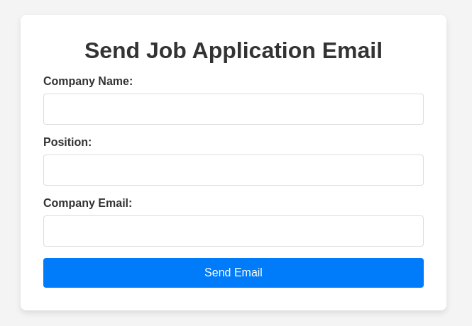

# Flash-Apply

Flash-Apply is a web application that allows users to send job application emails with an attached resume. The application features a simple form for entering company details and sends an email using Nodemailer.

## Features

- Send job application emails
- Attach a resume to the email
- Easy-to-use web interface

## Screenshots

 


## Installation

Follow these steps to get your development environment set up:

1. **Clone the repository**

    ```bash
    git clone https://github.com/ankittiwari2001/flash-apply.git
    cd flash-apply
    ```

2. **Install dependencies**

    ```bash
    npm install
    ```

3. **Set up environment variables**

    Create a `.env` file in the root directory and add your environment variables:

    ```
    EMAIL=your-email@gmail.com
    PASS_KEY=your-email-password
    PORT=3000
    ```

4. **Add your resume**

    Place your resume file in the `public` directory.

    ```
    /public/Ankit_FullStack_2-Years.pdf
    ```

5. **Edit the email template**

    To customize the email content, edit the `email_tamplate.js` file located in the `utils` directory. Modify the template string to fit your needs.

6. **Start the application**

    ```bash
    npm start
    ```

    The application will be running at [http://localhost:3000/](http://localhost:3000/).

## Usage

1. Open the application in your browser.
2. Fill out the form with the company name, position, and company email.
3. Click "Send Email" to send your job application email with the attached resume.


## Acknowledgments

- [Nodemailer](https://nodemailer.com/) for the email sending library
- [Express](https://expressjs.com/) for the web framework
- [Node.js](https://nodejs.org/) for the runtime environment
